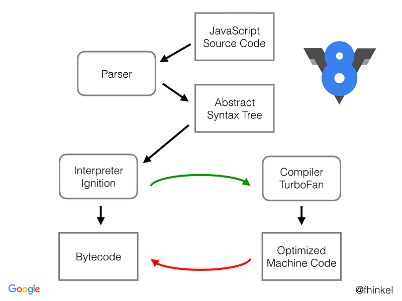

### Web Assembly

Era un caldo pomeriggio di giugno ed il mio smartphone squillò, segnalandomi l’arrivo di una nuova mail. Mi era stata recapitata la JavaScript Weekly, newsletter alla quale ero iscritto da qualche tempo. Come ogni settimana, leggo la mail alla ricerca di qualche accattivante articolo da leggere.

Una email di JavaScript Weekly

Leggendo la mail, sono stato incuriosito dal termine *WebAssembly*. L’accostamento di questi due termini stridevano nella mia mente perché, da software developer, pensavo a quanto sono concettualmente distanti lo sviluppo software in Assembly dallo sviluppo Web. Incuriosito, inizio a ricercare qualche informazione ponendomi sostanzialmente due domande:

* cos’è?
* perchè?

#### Cos’é WebAssembly?

Google é mio amico e mi porta diritto al sito ufficiale di WebAssembly. Questa mia ricerca sembra aver risposto alla mia prima domanda, trovando questa definizione:

> WebAssembly or *wasm* is a new portable, size- and load-time-efficient format suitable for compilation to the web.

Tutto chiaro no? Per niente. La mia curiosità è alimentata da questa criptica definizione. Ho continuato a ricercare informazioni, ho letto articoli, guardato video. Per farla breve, capisco che WebAssembly è una **virtual machine** pensata per il web.

#### Perché WebAssembly?

Finalmente ho capito cosa è WebAssembly. Ma a cosa serve una nuova tecnologia? Decine di framework, librerie e pacchetti creano fermento nel mondo dello sviluppo frontend. Perchè adottare una nuova tecnologia? La risposta che mi sono dato è stata questa: a causa di **Javascript**. Ma perchè? Volendo semplificare, direi che il problema é intrinsco nella sua natura, ma c’è molto di più. In base ai video che ho guardato, ai documenti che ho letto, le risposte che mi sono dato sono due.

In prima istanza, lo sviluppo di una applicazione web è strettamente legata a Javascript, in quanto è l’unico linguaggio eseguibile all’interno di un browser. Ció detto,uno sviluppatore non puó optare per una scelta differente oppure non puó utilizzate librerie scritte in altri linguaggi.

In seconda istanza, Javascript é un linguaggio:

* interpretato
* tipizzato dinamicamente
* tipizzazione debole

Queste sue caratteristiche rivelano dei pro e dei contro.

#### Inseguendo le performance

Le prime versioni degli interpreti si rivelarono molto lente. Con la [seconda guerra dei browser](https://it.wikipedia.org/wiki/Guerra_dei_browser#Seconda_guerra_dei_browser_%28dal_2004_ad_oggi%29), gli engine hanno avuto un incremento netto delle performance; *V8*, l’interprete Javascript di Google Chrome, ha introdotto *TurboFan* che effettua delle ottimizzazioni a runtime, andando ad identificare le porzioni di codice eseguite più spesso e ottimizzandole.

V8 con TurboFan

Questa soluzione ha portato ad un miglioramento delle performance, a scapito di un utilizzo maggiore della CPU e di un consumo maggiore della batteria sui dispositivi mobili. Oltre ad essere un linguaggio interpretato, Javascript è un linguaggio tipizzato dinamicamente; l’interprete deve definire il tipo di una variabile a runtime. Per capire quanto questo aspetto impatta sulle performance, faccio questo semplice esempio:

Function Javascript che restituisce il risultato dell’operatore addizione su due parametri

Questa function acquisisce in input due parametri e resistuisce la loro addizione. Da specifiche, l’operatore addizione è cosi definito:

Specifiche Javascript per l’operatore addizione

Si può ben immaginare la differenza di performance tra Javascript e qualsiasi linguaggio compilato come C o Rust, nei quali è obbligatorio esplicitare i tipi.

Per ovviare all’utilizzo di Javascript, in passato sono stati utilizzati differenti approcci.

Una strategia adottata fu l’approccio a plugin, ad esempio *Flash* e *Java*. Questi consentivano di sviluppare web app senza utilizzare Javascript, ma queste soluzioni presentavano dei problemi:

* sicurezza (aggiravano la sicurezza del browser)
* non permettevano interazioni con il DOM
* installazione componenti esterno (JVM ad esempio)

In particolare, le applicazione sviluppate in Java, necessitando di un componente esterno (Java Virtual Machine), erano inutilizzabili su disposivi mobili.

Nel 2013, Google progetto e realizzò un sistema chiamato *Google Native Client* (*NaCl*) che permetteva di sviluppare app con performance migliori, che giravano in una sandbox. Il progetto, adesso open source, non ha mai preso piede a causa della sua complessa architettura.

*asm.js* è un altro progetto che consente di eseguire codebase scritte in C o C++, con performance migliori di Javascript. *asm.js* consiste in un ristretto subset di costrutti di JavaScript, nel quale un linguaggio staticamente tipizzato (come C oppure C++) è transpilato da un transcompilatore, come Emscripten (basato su LLVM), utilizzando come target compiler *ASM*. Questa tecnologia offriva performance migliori, ma queste potevano variare radicalmente da una piattaforma ad un’altra.

WebAssembly è stato ideato partendo dai punti di forza e dalle debolezze di queste.

---

### Panoramica su WebAssembly

#### Design

WebAssembly è stato progettato seguendo questi principi:

* Portabile
* Estendibile
* Integrato con gli standard Web
* Basato su tool esistenti

WebAssembly è alla versione 1, che viene considerata a tutti gli effetti un *Minumum Viable Product* (MVP). Come asm.js, utilizza Emscripten per essere transpilato; è un compiler target di questo tool. WebAssembly è nativamente integrato all’interno dei web browser, non necessitando di plugin di terze parti. Ciò non toglie che possa essere utilizzato al di fuori di un browser. WebAssembly è [cross-browser](https://lists.w3.org/Archives/Public/public-webassembly/2017Feb/0002.html). La virtual machine offre lo stesso comportamento su Google Chrome, Firefox, WebKit, Edge(?). Il codice compilato per questo target è utilizzabile nel browser attraverso delle Javascript API. Con questa soluzione, vengono ereditate le policy di sicurezza del browser.

#### Modulo

In WebAssembly è centrale il concetto di modulo. Un modulo è una unità di codice che è:

* distribuibile
* caricabile
* eseguibile

By design, ogni modulo è diviso in differenti sezioni:

* import
* export
* start
* global
* memory
* data
* table
* elements
* function

Un modulo definisce anche diverse tabelle accessibili con un indice. Differenti operatori possono accedere direttamente alle entry mediante un indice. Le tabelle sono note come:

* memory index space
* function index space
* global index space
* table index space

Un modulo può avere due rappresentazioni

* binaria
* testuale

La rappresentazione binaria, avente estensione *.wasm*, è stata progettata per essere efficente e veloce. Di contro, la rappresentazione testuale, con estensione *.wast*, ha un formato simile al LISP e serve allo sviluppatore a comprendere meglio il risultato della transpilazione.

Un modulo può essere caricato ed eseguito all’interno di un browser solo ed escusivamente mediante le *API Javascript*, consentendo interoperabilità nei due versi.

#### Memoria lineare

In WebAssembly la memoria è lineare. E’ possibile considerarla come un array di byte non tipizzato. Alla versione 1, è definito un solo operatore, *grow\_memory*, che consente di variare la dimensione della memoria. Sulla memoria operano gli operatori *load* e *store*, utili a leggere e a scrivere informazioni sulla memoria. Avendo una rappresentazione lineare, l’indirizzamento è efficente ed efficace. Inoltre, ad ogni operazione sulla memoria è estremamente poco costosto effettuare un *out-of-bound check*. Ovvero, è possibile verificare che non si stia andando a leggere o a scrivere al di fuori dei confini consentiti. Ne caso di violazioni, viene lanciato un *Trap* che è intercettato dall’interprete Javascript lanciando una eccezione a runtime.

#### Strumenti

La toolchain di WebAssembly si basa su strumenti già esistenti, come *LLVM*, *Emscripten* e *Binaryen*.

#### Sicurezza

Ogni applicazione gira all’interno di una sandbox, proprio come in NaCl. WebAssembly eredita le policy di sicurezza del contesto in cui è incorporato; ad esempio, in un browser erediterà le sue policy di sicurezza. Inoltre, implementa un sistema di *Control Flow Integrity* ([CFI](http://webassembly.org/docs/security/#control-flow-integrity)) by design.

#### Sviluppi futuri

Essendo la versione 1 un MVP, WebAssembly non offre un set di funzionalità esauriente. Lo standard è in fase di sviluppo e nuove feature saranno aggiunte in futuro. Attualmente, sono supportati il tipo *void*, i tipi *int* e i tipi *float* a 32 e 64 bit.

Secondo la roadmap della comunità, le prossime feature annunciate sono:

* Supporto al Garbage Collector
* Supporto al multithread
* Gestione delle eccezioni
* wasm 64 bit