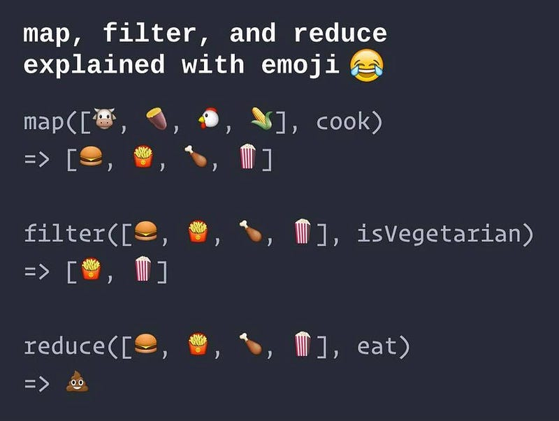

### C# & LINQ: Map, Filter & Reduce

#### Un semplice utilizzo di LINQ

Javascript, Javascript, Javascript. Ormai sono 3 anni che ho a che fare con questo, (a detta di molti) stravagante, linguaggio. Ho iniziato ad utilizzarlo costantemente con l’avvento di *AngularJS*. Negli ultimi due anni ho lavorato ad progetto molto vasto, la cui *Single Page Application* é scritta in *Typescript*.

Lavorare con JavaScript mi ha spinto, laddove possibile, ad adottare uno stile di programmazione più vicino ai linguaggi funzionali, soprattutto quando devo elaborare i dati di una collection.

Javascript mette a disposizioni le funzioni *map*, *reduce* e *filter* per effettuare operazioni sui dati di un array. Per spiegare il funzionamento di questi tre metodi basta guardare la seguente immagine.

Una spiegazione illustrata di Map, Filter e Reduce

Ho adorato l’adozione di questo stile fin dal primo istante. La sintassi di questi operatori mi è sembrata subito compatta, potente ed elegante. Ma c’é sempre un però. Come spesso capita quando lavori su un grande progetto, sono adottate differenti tecnologie; e quindi differenti linguaggi.

Dovevo implementare una API in C# e, dopo aver acquisito i dati dal database, avevo necessità di effettuare delle manipolazioni prima di ultimare l’esecuzione della funzione. Memore delle mie esperienze con Javascript, decido di utilizzare il medesimo approccio con *LINQ*. Questo componente di *.Net* consente di effettuare query e manipolazioni su collezione di dati mediante le sue API. Per mia grossa sorpresa, i metodi che erano di mio interesse erano presenti sotto un nome differente. In breve, ecco un elenco dei metodi messi a disposizione da LINQ e il corrispettivo in Javascript.

#### Select

Il metodo *Select* di LINQ consente di effetture l’operazione di mapping dei dati, in modo analogo ad una funzione *map*.

#### Where

Il metodo *Where* di LINQ consente di effetture l’operazione di filtering dei dati, in modo analogo al metodo *filter* degli array di Javascript.

#### Aggregate

Il metodo *Aggregate* di LINQ consente di effetture l’operazione di reducing dei dati, in modo analogo ad una funzione reduce.

LINQutilizza un naming differente rispetto a Javascript e, in alcuni casi, i metodi hanno una interfaccia differente al netto delle differenze tra C# e Javascript.

Ho scritto un piccolo esempio dell’utilizzo di questo approccio funzionale tramite LINQ. L’esempio é reperibile ed eseguibile a questo [link](https://repl.it/@valeriocomo/mapFilterReduce).