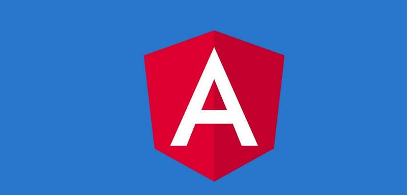

### Angular API Proxy

#### Bye bye CORS



Lavorare allo sviluppo di una applicazione Angular implica l’utilizzo di un web server di sviluppo. Come ogni Web Application, una Single Page Application Angular (SPA) effettua richieste HTTP ad un API server. Durante la fase di sviluppo, una Web Application Angular è servita da un web server che, di default, è in ascolto su porta *4200*. Contestualmente, il backend server è in ascolto su una porta differente; ad esempio sulla porta *80*, piuttosto che sulla porta *3000*.

Quindi, una richiesta HTTP dall’applicazione frontend verso il server delle API è una chiamata tra due domini differente. Infatti si parla di **Cross-Origin Resource Sharing (CORS)** quando una applicazione effettua una richiesta HTTP verso un server su un differente dominio o su una porta differente.

Per far si che tutto funzioni correttamente abbiamo due possibilità. La prima strada ci porta ad abilitare CORS. La seconda, oggetto dell’articolo, è nota come *server-side proxy*.

#### Webpack, DevServer e Proxy

Angular utilizza Webpack come tool di sviluppo. Webpack adotta un server di sviluppo, DevServer, che può essere configurato per agire da proxy tra la SPA e il server delle API. Questa configurazione è utile quando il server è su un altro dominio. Quando DevServer è configurato come proxy, il client effettua richieste HTTP sullo stesso dominio della applicazione front end. In pratica, DevServer si occupa di mediare la comunicazione tra Single Page Application e server backend.

#### Dalla teoria alla pratica

Supponiamo che la SPA venga servita da un server sulla porta 4200 e che il server delle API esponga un endpoint di questo tipo:

**GET** <http://localhost:8080/api/wines>

Se il client effettuasse una richiesta HTTP senza aver configurato il proxy o i CORS, il browser negherebbe la possibilità di raggiungere il server.


Figura 1: CORS abilitate

Configuriamo correttamente il proxy, delegando DevServer a fare da tramite tra applicazione front end e API server. Per raggiungere l’endpoint sopracitato, l’applicazione farà una richiesta a questa URL:

**GET** <http://localhost:4200/api/wines>

In pratica, la chiamata è effettuata sullo stesso dominio della applicazione Angular, ovvero verso DevServer.


Figura 2: Proxy configurato

#### **Configurazione**

La configurazione del proxy per un progetto Angular è molto semplice e compatta. Si articola in quattro operazioni.

* Creare un file di nome **proxy.conf.json** contenente la configurazione del proxy. Nella cartella root del progetto, eseguire il seguente comando da terminale

```bash
touch proxy.conf.json
```

* Aggiungere la configurazione di base, inserendo l’hostname e la porta sulla quale in backend server è in ascolto

```json
{  
  "/api": {  
    "target": "http://localhost:8080",  
    "secure": false  
  }  
}
```

* Modificare lo script di *start*, affiché il server di sviluppo legga la configurazione del proxy. Aprire il **package.json** e modifica lo script *start*. In alternativa, creare un task ex-novo con la medesima configurazione

```json
"start": "ng serve --proxy-config proxy.conf.json"
```

* Rilanciare il server di sviluppo affinchè vengano considerate le nuove configurazioni

```bash
npm start
```

Al termine di questi step, l’applicazione sarà in grado di effettuare richieste HTTP verso il server backend attraverso il proxy e senza dover abilitare CORS.

#### Nota bene

Questa configurazione non è pensata per un ambiente di produzione. Deve essere utilizzata solo per lo sviluppo della Web Application.