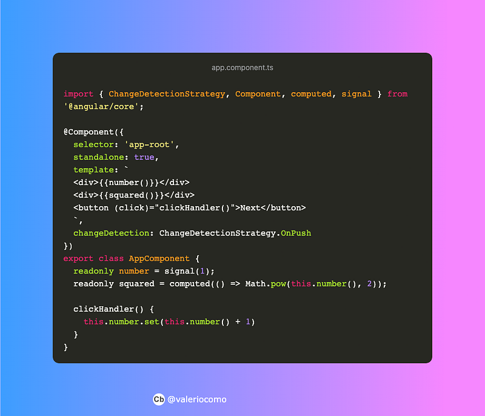

### Angular Signals

#### A new reactive primitive

Photo by [Carlos Alberto Gómez Iñiguez](https://unsplash.com/@iniguez?utm_source=medium&utm_medium=referral) on [Unsplash](https://unsplash.com?utm_source=medium&utm_medium=referral)

S***ignals*** is a new primitive, which aims to handle asynchronous events and supports developers in adoptions of reactive patterns. It will be released with *Angular* 16 but it’s yet available through an unstable version of the package (*16.0.0-next.0*).

You may be wondering:

> “is *RxJs* deprecated?”

The answer is simple: **no**.

*Signals* provide a straightforward approach to solve a similar problem. Take a look at this simple example.

In this example, we have two variables: *number* and *squared*.

I set *number* to 1 with the primitive *signal*. Then, *squared* is assigned with *compute* and a callback as parameter. Every time *number* is updated, *squared* will be updated too. Simply as hell. No more RxJS to handle those kind of async events. It’s a blurry memory but it recalls *signals and slots* pattern of *Qt*.

As general statement, s*ignals* implements a *producer/consumer* pattern.

### Why Signals?

The introduction of *signals* it’s the first step of a long-time change in Angular. *ChangeDetection* is the main topic and it’s related to the introduction of signals. Today, *ChangeDetection* is strictly bonded to *zone.js*. This lib is responsible for intercepting browser events and informs Angular that an event has been triggered. *zone.js* adoption has some advantages and some drawbacks.

*ChangeDetection* will be slightly different in the future with the adoption of *signals*. Components, as consumers, will be updated directly when a signal would produce a new value. It will be possible to avoid a complete check of the entire components tree, which is one of the main zone.js’ drawbacks.

### Signals API

Signals introduces a list of new APIs.

#### signal(value)

Create a producer. It’s where everything starts.

#### **set(value)**

This API set a new value. It produces a new value for all the subscribers.

#### **update(fn)**

*update* takes a callback as argument. This function has a parameter and it represents the current value. It’s useful when you need to create a new value starting from the previous one. The function will return a new value. Function execution produces a new immutable value. *update* allows you to work with immutable values.

#### mutate(fn)

*mutate* allows you to update the current value as update do. But there is an important difference: its params function doesn’t return a value. You could create a new value starting from the previous one but without changing its reference. So, it’s not useful if you would work with immutable values.

#### computed(fn)

*computed* aims to derive or calculate a new value starting from a *signal*. It will run its callback when a new value is emitted.

#### effect(fn)

In the same way of *computed*, *effect* provide an API to consume produced values programmatically. Its callback is subscriber and it will be executed every time a new value is produced.

### **Interoperability**

*signals* have to settle into a well-developed set of libraries. Some interoperability functions have been developed to interact with RxJS.

#### toObservable(signal)

Converts a signal into an observable.

#### toSignal(observable)

Converts an observable into a signal.

Other interoperability functions will be developed in the future. I would like to keep this list updated.

### Conclusion

*signals* will be shipped with Angular 16 as a developer preview. This is first step in order to take *zone.js* away from Angular.

*signals* introduction is crucial because it enables a finer-grain Change Detection implementation. Due to this reason, It leads to an increase of performance.

The Angular development team, once again, was able to introduce this innovation without compromising the stability of the ecosystem. It’ll be very interesting to hear the first feedback from the developers. And you? What do you think? Leave a comment below!

#### **EXTRA**

Check out this [repo](https://github.com/valeriocomo/angular-signals-demo) on Github.