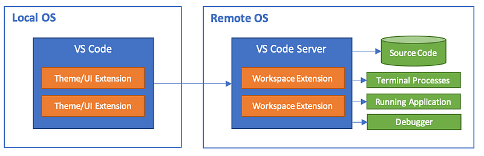
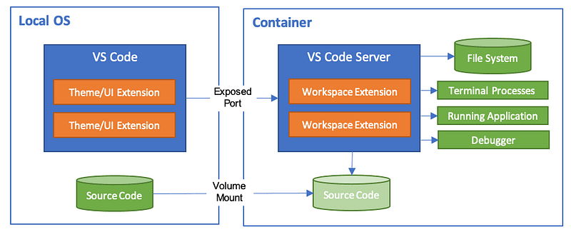
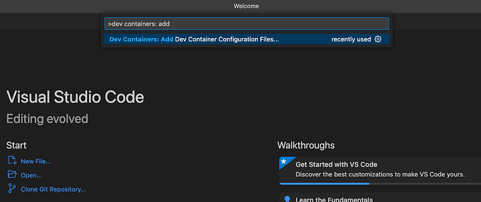
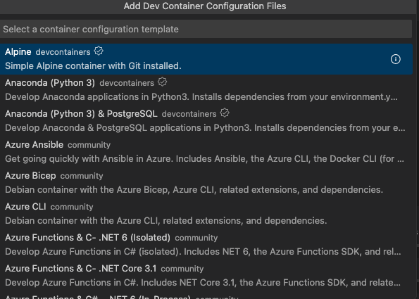
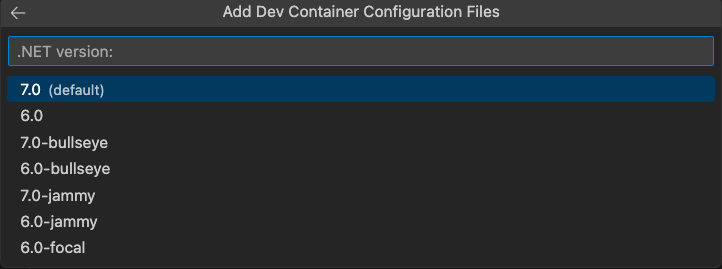
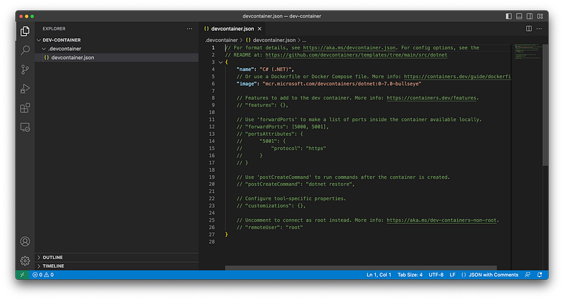
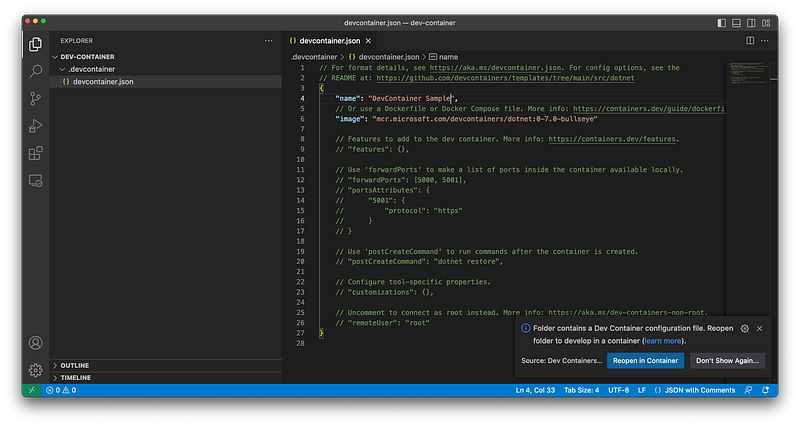
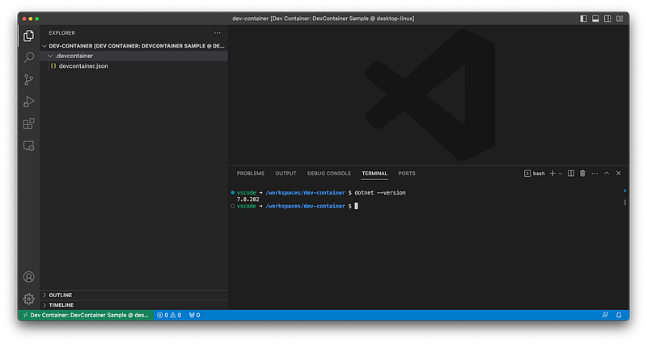

### VSCode Dev Containers

#### Containerization for automation of a project setup process

### Prologue

I get through a lot of projects everyday. Sometimes based on the same stack, sometimes on different technologies. At worst, projects are so dated in time that it is difficult to set it up on your PC.   
Whenever a colleague joins a project, solution setup takes up much of the time of the onboarding process.

Me at the end of an onboarding setup

Setting up a pc for a project is a process that has varying degrees of complexity. It’s a time-consuming and I’ve always wondered if and how it can be automated.

### Remote Extensions

*Remote Extensions* are common VSCode extensions and they enable developers to work on remote projects and systems without having to switch between different tools and environments, improving productivity and collaboration.

Developers could connect to a remote machine, container, or development environment and use VSCode to edit files, run and debug code, and perform other development tasks as if you were working locally.

VSCode Remote Development architecture from [official documentation](https://code.visualstudio.com/docs/remote/remote-overview).

There are different type of *Remote Extensions*:

* *SSH*: This extension enables you to connect to a remote machine using the *SSH* and work with files, terminals, and other VSCode features remotely.
* *Dev Containers*: This extension allows you to use Docker containers as a development environment for your projects. Developers can edit files, run and debug code, and test your applications within a container using VSCode.
* *WSL*: Almost like *Dev Containers* but within the *Windows Subsystem for Linux* (WSL) environment.

### **Dev Containers**

In the last 10 years, the popularity of containers has grown tremendously in the software development world. The concept of Dev Container takes the benefits of containerization and applies them to the development workflow.

#### What is a Dev Container?

A *Dev Container* is essentially a preconfigured development environment packaged in a Docker container. It has all the tools and dependencies required to develop a particular application. Developers can easily set up a consistent and isolated development environment, hypothetically identical to the production environment.

Architecture of Dev Containers from [official documentation](https://code.visualstudio.com/docs/devcontainers/containers)

#### Why Dev Containers?

Dev Container carries several benefits for developers, including:

1. **Consistency**: All the developers, working on same the project, could use the same development environment, mitigating configuration discrepancies.
2. **Isolation**: Development environment is isolated from the host machine, which ensures that any changes made to it will not affect the host machine.
3. **Portability**: It can be easily shared and used across different machines, making it easy either to onboard new team members or work on a project from multiple locations.
4. **Easy setup**: Setting up a development environment is simplified, replicable and automated, as all the necessary tools and dependencies are preconfigured within it.

#### Using VSCode Dev Containers

VSCode provides a simple and effective way to use Dev Containers. The process involves the following steps:

1. Just press *CMD + Shift + P* on MacOS or *CTRL + Shift + P* and just enter a search term at the prompt, as showed in the next image.

Create a configuration for a Dev Container

2. VSCode will show up a list of preset configuration.

Select a preset image

3. After a selection, you may be prompted by VSCode in order to customize your dev container’s configuration. Personal tip: if you work with *Apple ARM* architecture, remember to select *bullseye* version of Debian images.

Choose the version and other configurations

4. VSCode will create a folder and at least a configuration file within it, *devcontainer.json*. This file is a descriptor for a Dev Container.

A basic VSCode configuration

5. Click on **Reopen in Container** on the right side popup. Otherwise, you could use a top menu.

Run a Dev Container

6. VSCode will eventually create a container and it will run it.

A Dev Container for C# 7

Developers can then use VSCode’s powerful features, such as IntelliSense, debugging, and extensions, in the containerized development environment.

Please [check this repo out](https://github.com/valeriocomo/blog-dev-container-example). It contains the previous example and some extras (they are on the way).

### Conclusion

Dev Containers enable automation in project setup. No more waste of time. Everything is up and running in a time of a container’s build.

VSCode’s Dev Containers provide a simple and effective way to set up a containerized development environment that is consistent, isolated, and easily portable. Using Dev Containers can simplify the development workflow and eliminate potential configuration issues.

On the other hand, Dev Containers carries an overhead in terms of performance due to containerization, mainly on Windows. Furthermore, it uses a lot of space on your disk, so you might have to deal with free space handling.

If you haven’t yet tried Dev Containers, I highly recommend giving it a shot in your next project.

I’m really excited to know what you think about it, please leave a comment here!