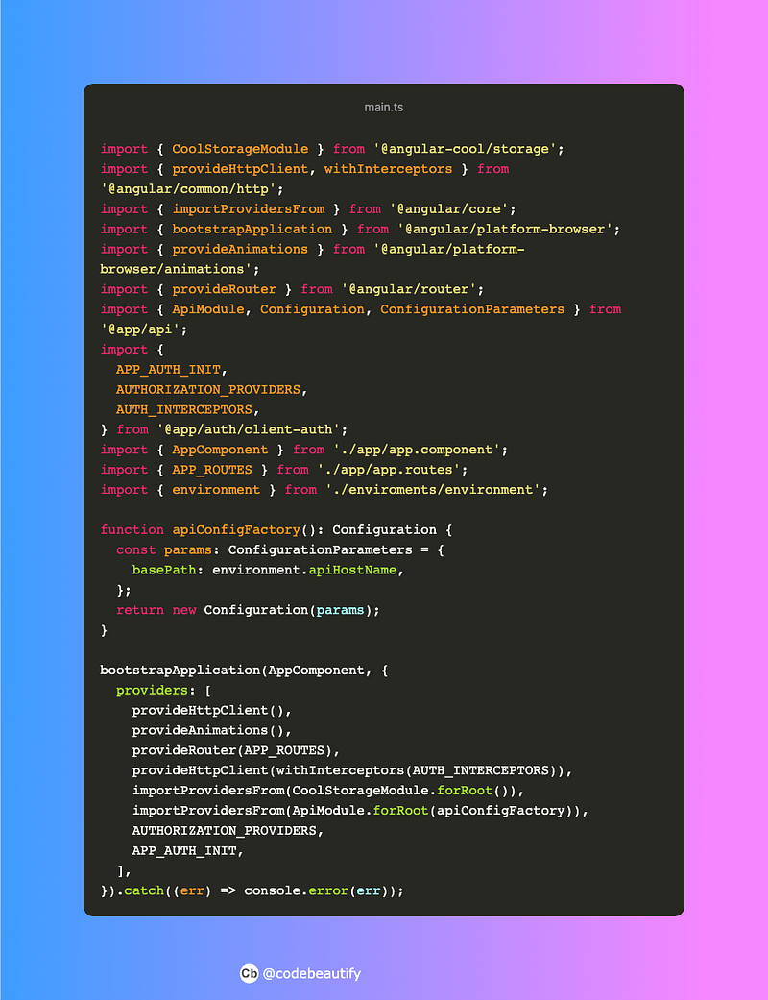
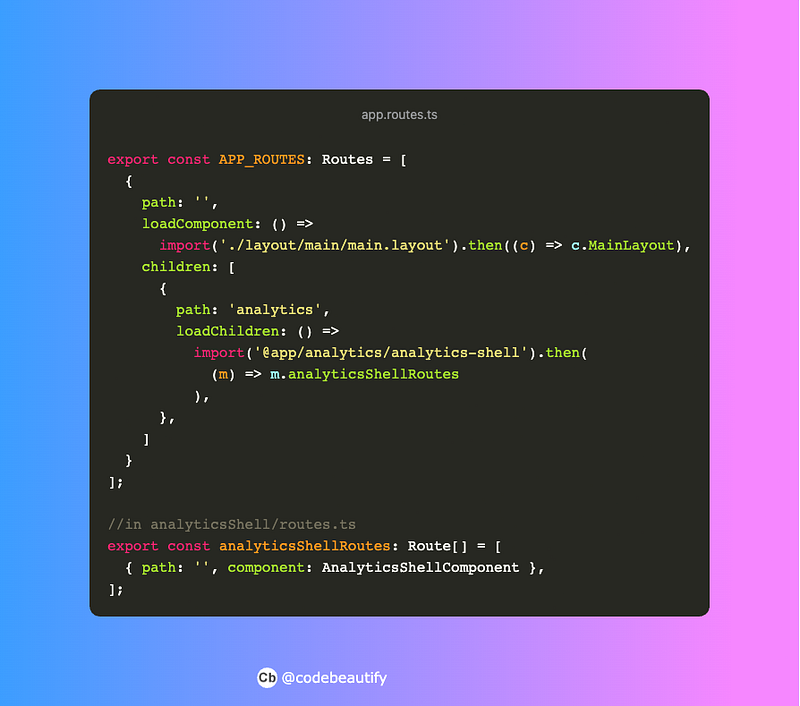

### Angular Standalone Components

#### Shifting from a module-oriented organization to a component-oriented one

Angular Standalone Components

*Standalone Components* is a one of the most interesting innovations in the Angular ecosystem in recent years. In my humble opinion, one of the most exciting alongside Angular Signals ([checkout my post about Signals!](/blog/2023-04-14_angular-signals)).

This feature aims to simplify the organization of an Angular project. Furthermore, it helps to flatten the learning curve, lowering the entry barrier for new developers.

### Why NgModule?

But, why does Angular need its own module system? An Angular module, *NgModule*, is a software artifact where developers could group together all the things like components, pipes, import libraries and so on. This is a good way to structure your code but there is also a practical reason behind it. A *NgModule* represents a compilation context. So, before *Ivy* compiler, Angular needed this organization. The adoption of the *Ivy* compiler have brought a straightforward innovation: every component has its own compilation context.

### Standalone Components Design

This is a simple example of a Standalone Component:

A simple example

Its design is similar to [Lars Nielsen](https://twitter.com/LayZeeDK)‘s *SCAM (Single Component Angular Module)* pattern. In *SCAM* pattern you have to declare a module as a wrapper for the component. With Standalone Components developers could declare everything inside Component decorator. Standalone Components aren’t declared like ol’ fashion components and they could be imported like modules.

#### Bootstrapping

The bootstrapping of an Angular application starts from a module (usually *AppModule)*.

The adoption of Standalone Components brings a new way to bootstrap an Angular application. This example is taken from a real project I am working on.

A main.ts taken form a real world project

The first great difference is the adoption of *bootstrapApplication* function. This function has two different parameters:

* A *Component*
* An object declaring application-wide providers

Here, developers can declare the providers that you would have declared in *AppModule*.

*importProvidersFrom* is an helper function provided by Angular. It supplies a simple way to give compatibility with *NgModule*. It accepts as argument an *NgModule* or *ModuleWithProviders*, returned from a *forRoot()* method.

Another class of helper functions are the ones with the prefix *provide*. They have been shipped with Standalone Components and they could provide application-wide providers or configuration. For instance, *provideRouter()* provides all the router configurations, even routes.

### Other Changes

Standalone Components brings a fresh air to Angular. Some tiny changes have been introduced.

#### Router

Standalone Components could be loaded lazily by using *loadComponent.*

A loadComponent example

In this example, you can figure out a new way of using *loadChildren*. Angular Router could load many routes at once, avoiding the use of *RouterModule.forChild* method.

The Router has acquired the ability to declare providers.

#### Directive & Pipes

Directives and Pipes gained a standalone flag in their decorator. They could be used like components. If you wanna use them, you’d have to import them. You don’t need to declare them anymore.

#### **Common Module**

*CommonModule* ships a lot of useful directives. Since Standalone Components adoption, developers could import just what they need. You could import just a specific directive, such as \*ngIf, \*ngFor, instead of the entire *CommonModule*.

### Conclusion

Those are the major updates shipped by Angular with Standalone Components. There are few other new features but they are out of the scope of this introduction.

I’ve already used Standalone Components in a real-world project. I have my own opinion about it but I would like to know yours! What’s your idea about Standalone Components? Feel free to leave a feedback in the comment section!