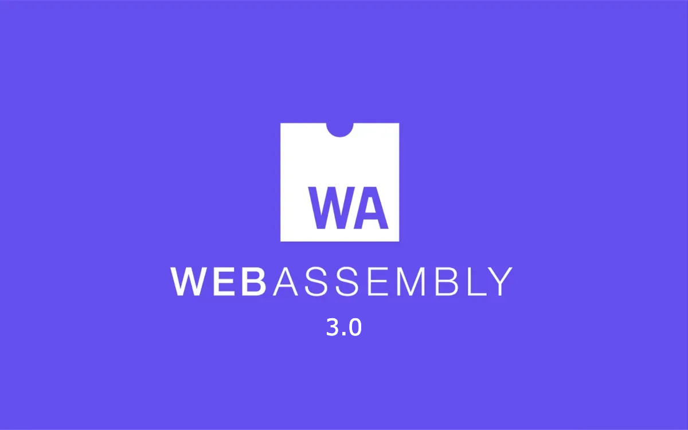

### Web Assembly 3.0
#### WASM 3 is here

Three years after the Wasm 2.0 standard was finalized, the Wasm W3C Community and Working Groups have officially released Wasm 3.0, establishing it as the new "live" standard. This isn't a minor patch - it's a massive update that delivers several big features, some of which have been six to eight years in the making.

### New Features

Here is a quick look at the core advancements Wasm 3.0 brings to developers.

#### Massive Scaling and Architectural Improvements

Wasm 3.0 significantly expands the capability of applications, especially those running outside the web ecosystem:

**64-bit Address Space**: Memories and tables can now use the i64 address type instead of just i32. This theoretically expands the available address space from 4 gigabytes to 16 exabytes. While web applications are limited to 16 gigabytes, non-web Wasm ecosystems can now support much larger applications and data sets.

**Multiple Memories in One Module**: Previously, using multiple memory objects required declaring and accessing them in separate modules. Now, a single module can declare or import multiple memories and access them directly, including copying data between them. This allows tools like wasm-merge (for static linking) to work for all Wasm modules and enables new security uses (separating private data) or buffering techniques.

#### High-Level Language Support is Now Native
Wasm 3.0 introduces crucial features that make compiling high-level programming languages much more efficient.

**Garbage Collection (Wasm GC)**: Wasm now supports a new form of automatically managed storage. Wasm GC is low-level; a compiler targeting Wasm can declare its runtime data structure layouts (struct, array types, tagged integers), and Wasm handles the allocation and lifetime management. This feature is focused purely on memory management and avoids built-in object systems or closures that would bias the standard towards specific languages.

**Exception Handling**: Modern languages rely on exceptions, but previously Wasm compilers had to use inefficient and non-portable methods (like escaping to the host language). Wasm 3.0 now provides native exception handling within Wasm, allowing exceptions to be defined, thrown, and selectively caught using tags and payload data.

**Tail Calls**: This variant of function calls immediately exits the current function, thus avoiding additional stack space usage. Tail calls are fully general in Wasm 3.0 and are crucial for functional language implementations.

**Typed References**: The new GC extension includes a richer type system. Reference types can now describe the exact shape of the referenced heap value, enabling safe indirect function calls via the new call_ref instruction without needing runtime checks.
Thanks to the GC feature, various new languages are popping up to target Wasm, including Java, OCaml, Scala, Kotlin, Scheme, and Dart

#### Boosting Performance and Reliability

Wasm 3.0 also refined performance and introduced tools for guaranteed determinism:

**Relaxed Vector Instructions**: To achieve maximum performance, Wasm 3.0 introduced "relaxed" variants of some Wasm 2.0 vector (SIMD) instructions. These variants are allowed implementation-dependent behavior in certain edge cases, squeezing out extra speed.

**Deterministic Profile**: For environments that demand reproducible execution (such as blockchains or replayable systems), the Wasm standard now specifies a deterministic default behavior for every instruction that might otherwise yield non-deterministic results. This includes floating-point operators and the new relaxed vector instructions, ensuring Wasm is fully reproducible between platforms implementing this profile.

### The AS-IS

Wasm 3.0 is already shipping in most major web browsers. Support in stand-alone engines, such as Wasmtime, is also nearing completion. Additionally, Wasm 3.0 is the first version of the standard produced using the new [SpecTec](https://webassembly.org/news/2025-03-27-spectec/) tool chain, which is expected to yield an even more reliable specification. For more infos about compatibility, check this [link](https://webassembly.org/features/) out.